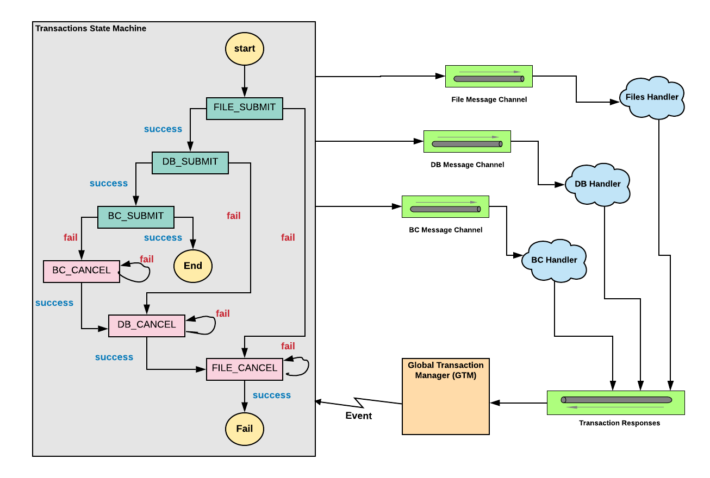

# Microservices Distributed Transaction Management

This demo project illustrates managing a transaction across
distributed microservices. 

The implemented Global Transaction Manager (GTM) leverages
a Spring State Machine to coordinate progression of successful 
individual local transactions and rollbacks. It also leverages Spring 
Cloud Stream to integrate with distributed services.

